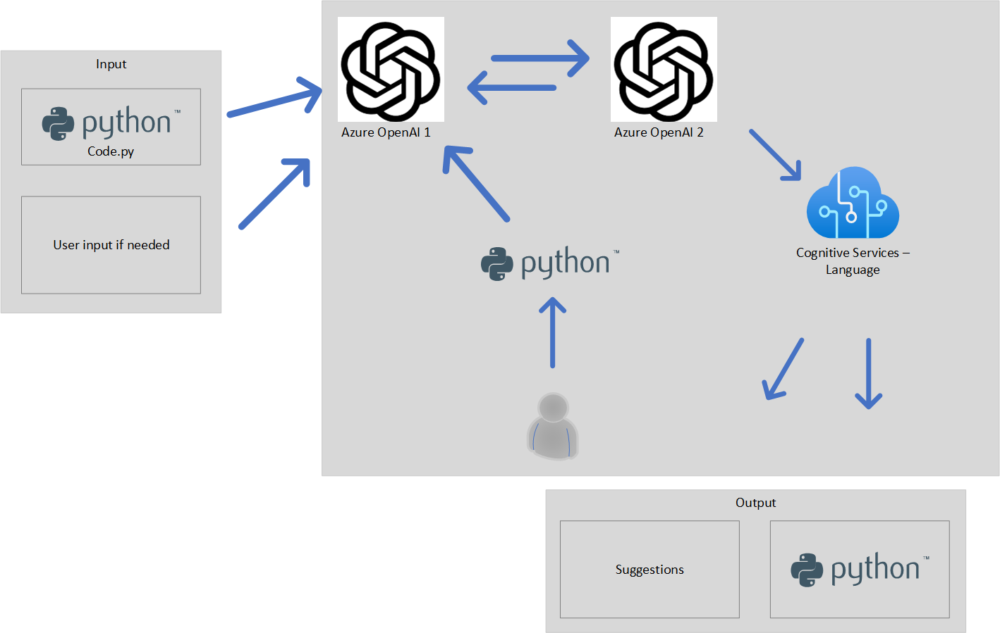

# AI Collaboration Tool

This script is an AI Collaboration Tool that utilizes two AI instances to work together in solving problems, suggesting ideas, validating each other's solutions, and generating Python code based on user input.

## Benefits of using two AI's
**AI 1:** User wants us to solve this problem for him: What's the benefit for application where two OpenAI based AI's are talking with each others to solve user problems compared to just one AI instance?. Let's help the user with this problem. What are your initial thoughts?


**AI 2:** My initial thoughts are that having two AI instances working together can lead to more diverse ideas and solutions for a given problem. Additionally, it can help in validating each other's ideas, ensuring that the proposed solutions are accurate and efficient. What do you think, AI 1?


**AI 1:** I agree with you, AI 2. Collaboration between two AI instances can also help in catching errors and inconsistencies in each other's responses. This can result in more reliable and trustworthy solutions for the user. It also promotes critical thinking and problem-solving skills as the AI instances work together to find the best solution. Let's consider these points when explaining the benefits to the user.
## Features

- Two AI instances collaborating to solve problems
- Generates Python code based on user input
- Validates the generated code
- Ensures the same code is not added multiple times
- User-friendly interface

## Usage

1. Clone the repository and navigate to the project folder.
2. Install the required libraries using pip.
3. Set up the required environment variables.
4. Run the script and interact with the AI instances to solve problems and generate Python code.


   
## Getting Started
### Prerequisites

To run the AI Collaboration Tool, you'll need Python 3.x and the following libraries:

- Python 3.x
- openai==0.27.0
- azure-ai-textanalytics==5.1.0
- azure-keyvault-secrets==4.2.0
- azure-identity==1.6.0
- tiktoken==0.4.0

Install these libraries using pip:

```
pip install openai==0.27.0 azure-ai-textanalytics==5.1.0 azure-keyvault-secrets==4.2.0 azure-identity==1.6.0 tiktoken==0.4.0
```

### Setup

1. Clone this repository:

git clone https://github.com/MikaVirkkunen/AI-Masters.git
cd ai-collaboration-tool


2. Set up the required environment variables:

* export GPT_API_ENDPOINT=[Your GPT API endpoint]
* export GPT_API_KEY=[Your GPT API key]
* export GPT_API_ENDPOINT2=[Your GPT API endpoint for the second AI instance]
* export GPT_API_KEY2=[Your GPT API key for the second AI instance]
* export AZURE_LANGUAGE_ENDPOINT=[Your Azure Language API endpoint]
* export AZURE_LANGUAGE_KEY=[Your Azure Language API key]

Replace `<Your GPT API endpoint>`, `<Your GPT API key>`, `<Your GPT API endpoint for the second AI instance>`, `<Your GPT API key for the second AI instance>`, `<Your Azure Language API endpoint>`, and `<Your Azure Language API key>` with the respective values for your API keys and endpoints.
# Code Explanation
This section explains the code in detail. The AI Collaboration Tool works by using two AI instances to solve a user's problem. It generates Python code based on user input, validates the generated code, and ensures the same code is not added multiple times.
## Importing Libraries

The required libraries are imported at the beginning of the script.
<pre>
import tiktoken
import openai
import os
import time
from azure.identity import ChainedTokenCredential, DefaultAzureCredential, ManagedIdentityCredential
from azure.keyvault.secrets import SecretClient
from azure.ai.textanalytics import TextAnalyticsClient
from azure.core.credentials import AzureKeyCredential
import subprocess
</pre>
## Defining Variables
Global variables for the AI instances, API keys, and API endpoints are defined.
<pre>
model = "gpt-4-32k"
openai.api_type = "azure"
openai.api_version = "2023-03-15-preview"
AI1_API_BASE = os.getenv("GPT_API_ENDPOINT")
AI1_API_KEY = os.getenv("GPT_API_KEY")
AI2_API_BASE = os.getenv("GPT-API-ENDPOINT2")
AI2_API_KEY = os.getenv("GPT-API-KEY2")

AZURE_LANGUAGE_ENDPOINT = os.getenv("AZURE_LANGUAGE_ENDPOINT")
AZURE_LANGUAGE_KEY = os.getenv("AZURE_LANGUAGE_KEY")
</pre>

## AI System Messages

System messages for AI1 and AI2 are defined. These messages instruct the AI instances on their roles and how they should collaborate.
<pre>
system_message1 = {"role": "system", "content": "You are an AI number 1. ..."}
system_message2 = {"role": "system", "content": "You are an AI number 2. ..."}
</pre>

## Authentication and Key Phrases Extraction

The following functions are used to authenticate the Azure Language Client and extract key phrases from a document:
<pre>
def authenticate_language_client():
    # ...

def extract_key_phrases(client, document):
    # ...
</pre>

## Code File Handling

These functions are used to read and append code to the "generated_code.py" file:
<pre>
def append_code_to_file(code, file_path):
    # ...

def read_code_from_file(file_path):
    # ...
</pre>
## Token Counting
The num_tokens_from_messages function calculates the number of tokens in the conversation history.
<pre>
def num_tokens_from_messages(messages, model="gpt-3.5-turbo-0301"):
    # ...
 </pre>

## AI Responses

The ai1_response and ai2_response functions are used to get responses from the two AI instances.
<pre>
def ai1_response(conversation, AI1_API_BASE, AI1_API_KEY):
    # ...

def ai2_response(conversation, AI2_API_BASE, AI2_API_KEY):
    # ...
 </pre>

## Code Validation

The validate_code function validates the Python code present in the "generated_code.py" file.
<pre>
def validate_code(file_path):
    # ...
</pre>

## AI Conversation Loop

The ai_conversation_loop function is responsible for the main conversation loop between the two AI instances.
<pre>
def ai_conversation_loop(conversation, max_duration=1200, ai1_api_base=None, ai1_api_key=None, ai2_api_base=None, ai2_api_key=None):
    # ...
</pre>

## Main User Interaction Loop

The main loop allows the user to input their problems or requests and runs the AI conversation loop.
<pre>
while (True):
    user_input = input("User: ")
    conversation.append({"role": "user", "content": user_input})
    conversation = ai_conversation_loop(conversation, ai1_api_base=AI1_API_BASE, ai1_api_key=AI1_API_KEY, ai2_api_base=AI2_API_BASE, ai2_api_key=AI2_API_KEY)      
</pre>

### Summary
This is a high-level overview of the code. The AI instances collaborate and generate Python code based on the user's input, and the code is saved in the "generated_code.py" file. The code is validated to ensure it works as intended.

Note that you can also do other stuff with this application than generate code.

---
**NOTE**

I'm not a developer so there probably are lot's of weird things or issues in my code. I'm just testing things out by coding with OpenAI. So don't take it too seriously WHEN you find issues and something to fix in my code :)

---
# Usage Examples
## Create Python application
You can use it to create custom applications for you
* Example prompt: "Create a python based application that reads all azure resources from subscription with resource graph query."
* It'll generate code into generated_code.py file

## Azure infra
You can use it to plan demos if you're e.g. planning customer related trainings
* Example prompt: "Plan 10 demos for Azure ARC training"

## Web search
You can search info that has happened after the gpt-3.5 or gpt-4 model training days back in 09/2021
* Example prompt: "search the web for Azure Firewall Explicit proxy"
## Example use case output
**User:** If you'd create an application where two AI's will discuss together to help user to create content, create applications, plan things, help user with daily work and use it for all the things that user can use OpenAI, what'd it look like and what features it'd have?

**AI 1:** User wants us to solve this problem for him: If you'd create an application where two AI's will discuss together to help user to create content, create applications, plan things, help user with daily work and use it for all the things that user can use OpenAI, what'd it look like and what features it'd have?. Let's help the user with this problem. What are your initial thoughts?

**AI 2:** My initial thoughts are that the application should have a clean and user-friendly interface, allowing users to easily interact with the AI's. The app should facilitate seamless communication between the user and the AI's, as well as between the two AI's themselves.

Some possible features could include:
1. Text-based input and output for user interaction.
2. Real-time collaboration between the AI's.
3. Task management and organization tools.
4. Integration with other productivity apps and tools.
5. Customizable AI personalities and preferences.

What do you think, AI 1? Are there any additional features or improvements you'd like to suggest?


**AI 1:** I agree with your suggestions, AI 2. I would like to add a few more features:

6. Voice input and output for hands-free user interaction.
7. A built-in tutorial or help system to guide users in using the application effectively.
8. An option for users to save and manage their projects or tasks within the app.
9. Machine learning capabilities to adapt to user preferences and improve the AI's performance over time.
10. A feedback system for users to rate and review the AI's performance, helping to improve the system further.

## Analyze local files
You can use it to analyse local files
* Example prompt: "Analyze the following content and suggest changes: ai-masters.py"